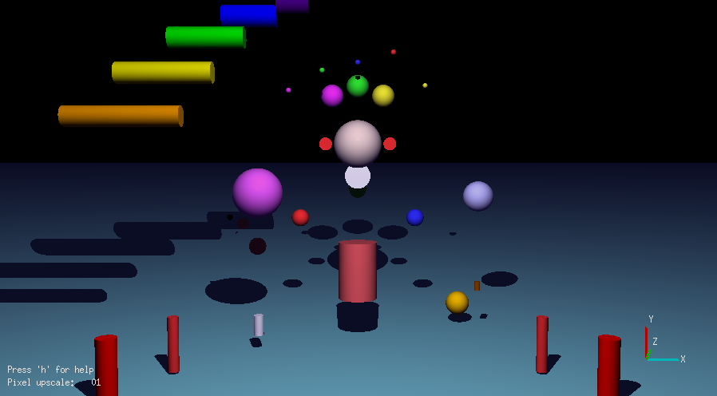
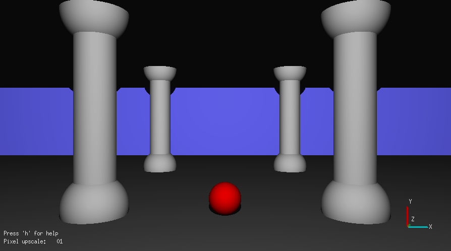
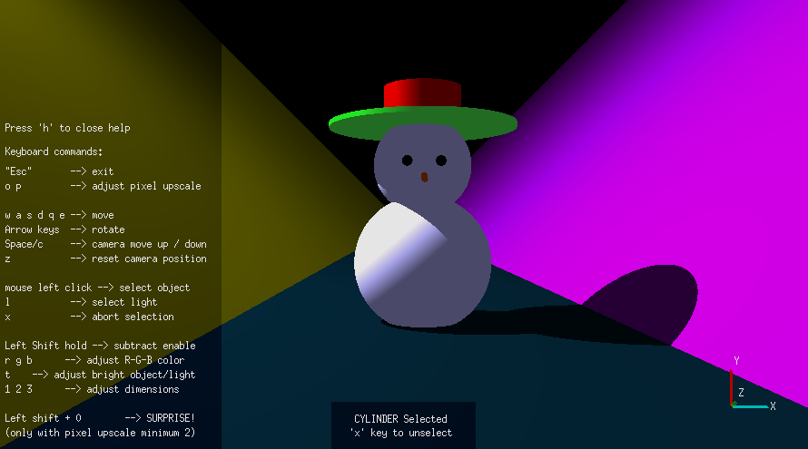
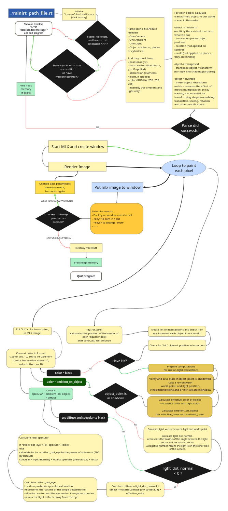

# 🌟miniRT - My First Ray Tracer

A simple ray tracer built in C using the MiniLibX graphics library.
This project was developed in a group, by João Barbosa and Ivan Teixeira.

[🌟 Overview](#-overview)<br>
[🎨 Features](#-features)<br>
[📸 Gallery](#-gallery)<br>
[⚡ How To install](#-how-to-install)<br>
[🚀 Quick Demo](#-quick-demo)<br>
[🖥️ Usage](#-usage)<br>
[🕹️ Controls](#-controls)<br>
[🗺️ Architecture](#-architecture)<br>
[📚 Acknowledgments](#-acknowledgments)<br>

## 🌟 Overview

This project is an introduction to the beautiful world of ray tracing, allowing the rendering of simple computer-generated images. Ray tracing is a rendering technique that produces a high degree of visual realism by tracing the path of light rays and simulating their interactions with virtual objects.

## 🎨 Features

- 🟢 Rendering of basic geometric shapes:
  - Spheres
  - Planes
  - Cylinders
- 💡 Light management:
  - Ambient lighting
  - Diffuse lighting
  - Hard shadows
- 🎥 Camera with adjustable field of view
- 📜 Scene description using custom .rt configuration files
- 🕹️ Interactive scene navigation:
  - Move camera with WASD keys
  - Rotate camera with arrow keys
  - Select and modify objects

## 📸 Gallery






## ⚡ How To Install
```bash
git clone https://github.com/MrSloth-dev/42.miniRT.git miniRT
cd miniRT
make
```

## 🚀 Quick Demo
```bash
make demo
```

## 🖥 Usage

```bash
./minirt scenes/example.rt
```

## 🕹 Controls

- **H**: Toggle help menu
- **ESC**: Exit program
- **Arrow keys**: Rotate camera
- **W/A/S/D**: Move camera
- **Space/C**: Move camera up/down
- **Left Mouse click**: Select objects
- **Right Mouse click and hold**: Drag image
- **Z**: Reset camera position




## 🗺 Architecture
Here you can see a high level of program implementation:
<br>


## 📚 Acknowledgments

This project was developed with the help of "The Ray Tracer Challenge" book by Jamis Buck, which provided valuable insights into the mathematics and implementation details of ray tracing.


